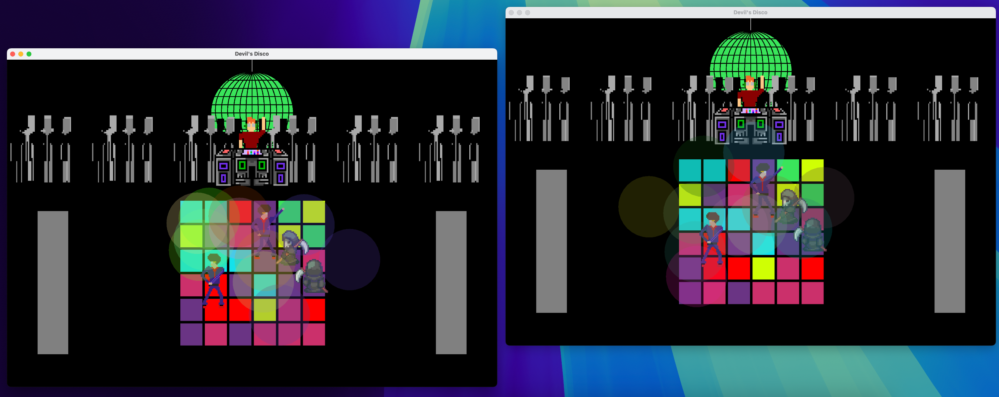
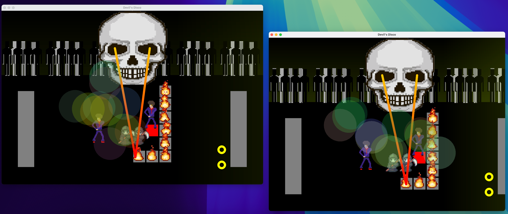
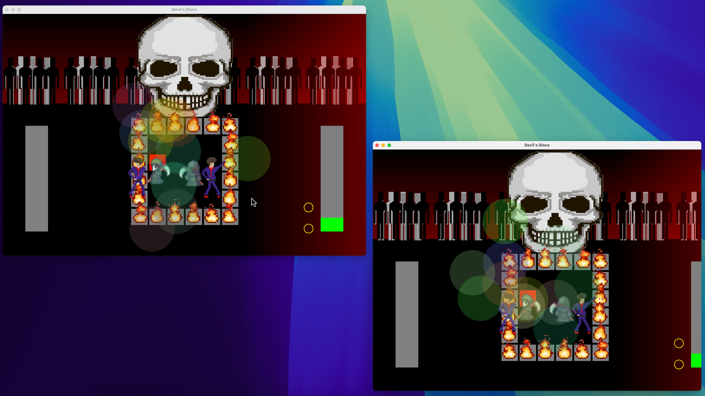

# Devils Disco

A 1v1 tile-based rhythm game, implementing gameplay and graphics using Java and the Java2D API

Open 'Manual-Devil's Disco.pdf' for instructions on gameplay and controls.

# How to Start

1. Compile the java files with:

javac *.java

2. Start the server with:

java GameServer

3. On two seperate terminals, run:

java GameStarter

The game will start when two players have connected to the server via this command.
